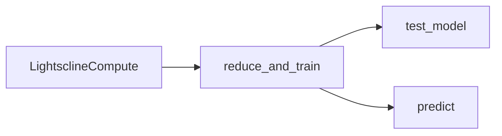

# Lightscline Compute Documentation

Lightscline Compute uses Lightscline's proprietary smart sampling technology and backend to train efficient AI models on just 5-10% smartly sampled sensor data. 

## Getting started

```python
from lightscline.lightscline import LightsclineCompute

# 3D training data: (n_classes, n_channels, n_samples)
ls = LightsclineCompute(data=my_data, fs=[1700, 1200], labels=[0, 1, 2])

# Window, reduce, and train in one step
ls.reduce_and_train(per_reduction=90, window_time=0.2, n_iters=1000)
accuracy = ls.test_model()

# Inference on new samples (same channel layout as one class)
predictions = ls.predict(X_test)
```

## Requirements

- Python 3.9, 3.10, or 3.11
- Dependencies: `numpy`, `torch+cpu`, `scikit-learn`

On import, the library prints a pilot-version notice and validates the license date embedded in the build.

## Documentation index

| Document | Description |
|----------|-------------|
| [LightsclineCompute API](lightscline-compute-api.md) | Public methods, data shapes, parameters, and pilot limitations |

## Typical workflow



## Support

For the full product (save/load, optimization, self-training, custom loss, and more), contact [info@lightscline.com](mailto:info@lightscline.com).
